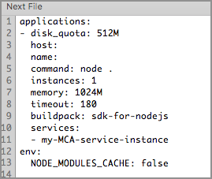

# helloTodoAdvanced Sample Application for Bluemix Mobile Services
---
This helloTodoAdvanced sample app contains an Objective-C project, an Android project, and a Node.js application that communicates with a StrongLoop-based mobile backend created with the MobileFirst Services Starter Boilerplate on IBM&reg; Bluemix&reg;. It extends the original helloTodo application to include authentication using Mobile Client Access and Facebook, along with a Node.js modification to securely send Push Notifications using IBM Push Notifications.


### Before you begin
Before you start, make sure that you have:
* A [Bluemix](http://bluemix.net) account
* Facebook Developer Application.  
[Learn more about using Facebook as an identity provider](https://www.ng.bluemix.net/docs/services/mobileaccess/security/facebook/t_fb_config.html)


**iOS:**  
* XCode Version 7.1
* Physical iOS device
* Valid APNs enabled bundle id
* Provisioning profile
* Development certificate

> **Note:** For push notifications to work successfully, you must run the helloTodoAdvanced sample on a physical iOS device with a valid APNs enabled bundle id, provisioning profile, and development certificate.

**Android:**  
* Android Studio
* Google Cloud Messaging (GCM) credentials. To obtain your GCM credentials, follow the instructions at  
[configuring push credentials for GCM](https://www.ng.bluemix.net/docs/services/mobilepush/t_push_config_provider_android.html)

### Configure the helloTodo-Advanced sample

Use the following steps to configure the helloTodo-Advanced sample:

1. [Download the helloTodoAdvanced sample](#download-the-hellotodoadvanced-sample)
2. [Configure the mobile backend for your helloTodoAdvanced application](#configure-the-mobile-backend-for-your-hellotodoadvanced-application)
3. [Configure the Mobile Client Access service](#configure-the-mobile-client-access-service)
4. [Configure the IBM Push Notifications service](#configure-the-ibm-push-notifications-service)
5. [Deploy the custom Node application to Bluemix](#deploy-the-custom-node-application-to-bluemix)
6. [Configure the front end in the helloTodoAdvanced sample](#configure-the-front-end-in-the-hellotodoadvanced-sample)
7. [Run the helloTodoAdvanced sample application](#run-the-hellotodoadvanced-sample-application)


### Download the helloTodoAdvanced sample
Clone the sample from Github with the following command:

```git clone https://github.com/ibm-bluemix-mobile-services/bms-samples-hellotodo-advanced```

### Configure the mobile backend for your helloTodoAdvanced application

Before you can run the helloTodoAdvanced application, you must set up a mobile backend for your app on Bluemix.

> If you have already created a mobile backend with the MobileFirst Services Starter boilerplate, you might want to skip to the [Configuring the front end in the helloTodoAdvanced sample](#configuring-the-front-end-in-the-hellotodo-sample) section.

  The following procedure shows you how to create a MobileFirst Services Starter application. Using the boilerplate to create your app automatically performs the following actions:

* Provisions a Node.js runtime and populates it with with a default helloTodoAdvanced application that was created with StrongLoop. This application uses the LoopBack framework to expose the `/api/Items` API, which is used by both the Web UI and the helloTodoAdvancedapp sample from this Github repository.
* Adds the following services to the app: Cloudant&reg; NoSQL DB, IBM Push Notifications, and Mobile Client Access.

#### Create a mobile backend in the  Bluemix dashboard

1.	In the **Boilerplates** section of the Bluemix catalog, click **MobileFirst Services Starter**.
2.	Enter a name and host for your mobile backend and click **Create**.
3.	Click **Finish**.
4. Get information about your app. <br/> After the provisioning process is complete, you will see a a page for your newly provisioned mobile backend. Click the **Mobile Options** link in top right part of a screen to find your *appRoute* and *appGUID*. Keep this screen open in your browser; you will need these parameters in the next steps.

#### Access the StrongLoop backend app

1. Open the **appRoute** URL that you copied from the Bluemix dashboard in your browser. You will see the web interface for the helloTodoAdvanced backend.
2. Start by following the guided experience steps that are described in the web UI. <br/>Eventually, you will try to DELETE a todo item and will discover that this action can only be complete when using the helloTodoAdvanced mobile apps sample from this Github repository.The mobile backend is protected by a Mobile Client Access by default.  Mobile Client Access is a Bluemix service that provides security and monitoring functionality for mobile backend applications.

> **Tip:** Click the **View API Reference** button on web UI to see the API specs.

### Deploy the custom Node application to Bluemix

The helloTodoAvanced application requires custom code to be deployed to the Node.js application running on Bluemix. This code handles protecting specific endpoints with MCA, such as deleting an item from the list. Also provided in the custom Node.js code is a function that handles sending Push notifications to all registered devices when an item has been marked as completed. You can look more into this custom code here:

[Custom Node.js code](https://github.com/ibm-bluemix-mobile-services/bms-samples-hellotodo-advanced/blob/master/NodeJS/server/server.js)

Deploying the applicaiton:  
1. Edit `manifest.yml` file. Change the `host` property to some unique value. It is currently empty in the provided `manifest.yml`.  
2. Edit `manifest.yml` file and add the services section. Add the Mobile Client Access service instance name created in previous steps. Final result should look like this.    
  
3. Use `cf push <Bluemix_Application_Name>` command to deploy your application to Bluemix, bind it to Mobile Client Access service instance and start it.  
4. Once deployment completes successfully use `cf apps` command to see the list of available applications and their routes  
5. Your Bluemix application should be available at `https//{hostname-from-manifest.yml}.mybluemix.net`


### Configure the Mobile Client Access service

1.	In the Mobile Client Access dashboard, go to the **Authentication** tab to configure your authentication service.  
2.  Choose your authentication type (this sample has been configured for Facebook authentication).
3.  Enter the required configuration settings (APP ID for Facebook authentication).

### Configure the IBM Push Notifications service

**iOS:**  
1.	In the IBM Push Notifications Dashboard, go to the **Configuration** tab to configure your Push Notification Service.  
2.  In the Apple Push Certificate section, select the Sandbox environment.  
3.  Upload a valid APNs enabled push certificate (.p12 file), then enter the password associated with the certificate.  

**Android:**  
1. In the IBM Push Notifications Dashboard, go to the **Configuration** tab to configure your Push Notification Service.  
2. Scroll down to the **Google Cloud Messaging** section. Enter your GCM project credentials, project number (Sender ID) and API key, and click **save**.  

### Configure the front end in the helloTodoAdvanced sample

**iOS:**  
1. In a terminal, navigate to the `bms-samples-hellotodo-advanced` directory where the project was cloned.  
2. Navigate to the `iOS` folder.  
3. If the CocoaPods client is not installed, run the following command: `sudo gem install cocoapods`  
4. If the CocoaPods repository is not configured, run the following command: `pod setup`  
5. To download and install the required dependencies, run the following commmand: `pod install`  
6. Open the Xcode workspace: `open helloToDoAdvanced.xcworkspace`. From now on, open the xcworkspace file because it contains all the dependencies and configuration.  
7. Open the `helloToDoAdvanced/AppDelegate.m` file and add the corresponding **ApplicationRoute** and  
**ApplicationID** values (found in the **Mobile Options** link on the Bluemix Dashboard) in the application `didFinishLaunchingWithOptions` method:  

```objective-c  
(BOOL)application:(UIApplication *)application didFinishLaunchingWithOptions:(NSDictionary *)launchOptions {

//initialize SDK with IBM Bluemix application ID and route
//TODO: Enter a valid ApplicationRoute for initializaWithBackend Route and a valid ApplicationId for backendGUID
IMFClient *imfClient = [IMFClient sharedInstance];
[imfClient initializeWithBackendRoute:@"<APPLICATION_ROUTE>" backendGUID:@"<APPLICATION_ID>"];			

return YES;
}
```

**Android:**  

1. In Android Studio, open the helloTodoAdvanced Android project.
2. Run a Gradle sync (usually starts automatically) to import the required `core` and `push` SDKs. You can view the **build.gradle** file in the following directory:

	`helloTodoAdvanced\app\build.gradle`
	
3. Open the `MainActivity.java` class.
4. In the application `onCreate` method, add the corresponding `ApplicationRoute` and `ApplicationID`:


```Java
	@Override
    protected void onCreate(Bundle savedInstanceState) {
        super.onCreate(savedInstanceState);
        setContentView(R.layout.activity_main);

		...
		
        try {
            //initialize SDK with IBM Bluemix application ID and route
            //TODO: Please replace <APPLICATION_ROUTE> with a valid ApplicationRoute and <APPLICATION_ID> with a valid ApplicationId
            BMSClient.getInstance().initialize(this, "<APPLICATION_ROUTE>", "<APPLICATION_ID>");
        }
        catch (MalformedURLException mue) {
            ....
        }
```

> **Note**: This sample depends on 1.+ version of the Core SDK. This means that the most recent 1.* version will be downloaded automatically. When creating a production applications it is recommended to define the version explicitly (1.0.0 for example) to ensure consistent builds.


### Setting up Facebook authentication

**iOS:**  
Update the `Info.plist` file with your Facebook App information:  

- **FacebookAppID** (For example `1581349575427190`): You can get the App ID from the Facebook developer console.  
- **FacebookDisplayName** (For example `helloAuth`): You can get App name from Facebook developer console.  

Update URL Types, Item 0, URL Schemes, update Item 0 as follows:  

- **URL Schemes**: (for example `fb1581349575427190` , fb+Client ID from Facebook developer console)  

**Android:**  
Navigate to the strings.xml (`Android\helloTodoAdvanced\bluelist\app\src\main\res\values\strings.xml`) and enter the Facebook AppId to the ```facebook_app_id``` value.


For the helloTodoAdvanced sample, you will need to make sure your Google Play package name in your Facebook app is `com.ibm.helloTodoAdvanced` and that your class name is `com.ibm.helloTodoAdvanced.MainActivity`.


### Run the helloTodoAdvanced sample application

**iOS:**  
In Xcode, click **Product > Run**.  

**Android:**  
In Android click run and select a device.


The helloTodoAdvanced sample is a single view application with a simple list of to do items. If you previously added data through your web application, you will see the data is automatically pulled into the application.  

#### Modify to do items in the mobile app
You can create, add, and modify items directly in the application. This sample uses Bluemix Mobile Services SDK, which knows how to handle Mobile Client Access security. Therefore, unlike the web application, you can also DELETE items from mobile app by swiping them for iOS, hold to delete for Android. You can also mark items as completed by clicking to the left of the corresponding to do item. When you update an item in the mobile app it will automatically be updated in the web app (you need to refresh the web app). If you make a change in the web UI and want to see it reflected in the mobile app, pull down the todo list to refresh.  

### Using Facebook Authentication in the helloTodoAdvanced application
As you recall, the DELETE endpoint can only be accessed by mobile applications because it is protected by the Mobile Client Access service. Since we have setup MCA with Facebook authentication, login will be required to complete these protected actions. To simplify user experience, the helloTodoAdvanced application required login when the application first loads. 

### Sending Push notifications to all registered devices
Custom Node.js code has been provided in this sample that handles sending push notifications to registered devices whenever an helloTodo item it marked complete. This is accomplished in the following manner:  
1. A URL endpoint (<ApplicationRoute>/notifyAllDevices) has been created when the custom Node.js application was deployed to your Bluemix application.  
2. Client side code has been provided (notifyAllDevices function), that handles sending a Post request to our notifyAllDevices endpoint on Bluemix.  
3. When an item is marked as complete, we send the corresponding item information to our Node.js application. Our custom code then creates and sends out a push notification to all registered devices, informing the item has been completed.  

**Note:** The /notifyAllDevices endpoint has also been protected by MCA and the Facebook authentication we have configured. You will only be able to send these notifications once you have successfully logged in to Facebook from the client side application.


### Xcode requirement
The project has bitcode support disabled because the Bluemix Mobile Services SDK does not currently support bitcode. For more information, see: [Connect Your iOS 9 App to Bluemix](https://developer.ibm.com/bluemix/2015/09/16/connect-your-ios-9-app-to-bluemix/)

### License
This package contains sample code provided in source code form. The samples are licensed under the under the Apache License, Version 2.0 (the "License"). You may obtain a copy of the License at http://www.apache.org/licenses/LICENSE-2.0 and may also view the license in the license.txt file within this package. Also see the notices.txt file within this package for additional notices.
