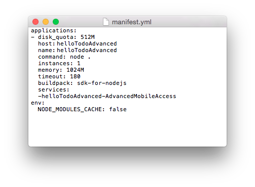
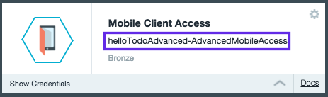

# helloTodoAdvanced sample application for Bluemix Mobile Services
---
This helloTodoAdvanced sample app contains an Objective-C project, an Android project, and a Node.js application that communicates with a StrongLoop-based mobile backend created with the MobileFirst&trade; Services Starter Boilerplate on IBM&reg; Bluemix&reg;. The sample extends the helloTodo application to include:
* Authentication with the IBM Mobile Client Access for Bluemix service and Facebook identity provider.
* Node.js modification to securely send push notifications with the IBM Push Notifications for Bluemix service.

### Before you begin
  Before you start, make sure that you have:
 * A [Bluemix](http://bluemix.net) account  
 * [Cloud Foundry CLI](https://github.com/cloudfoundry/cli/releases)
 * Facebook Developer Application. 
 [Learn more about using Facebook as an identity provider](https://www.ng.bluemix.net/docs/services/mobileaccess/security/facebook/t_fb_config.html)
 
 
**iOS:**  
* XCode Version 7.1
* Physical iOS device
* Properly Configured APNs Artifacts. To create and configure your APNs credentials, follow the instructions at  
[Creating and configuring push credentials for APNs](https://www.ng.bluemix.net/docs/services/mobilepush/t_push_config_provider_ios.html)

> **Note:** For push notifications to work successfully, you must run the helloTodoAdvanced sample on a physical iOS device with a valid APNs enabled bundle id, provisioning profile, and development certificate.
 
**Android:**  
* Android Studio
* Google Cloud Messaging (GCM) credentials. To obtain your GCM credentials, follow the instructions at  
[configuring push credentials for GCM](https://www.ng.bluemix.net/docs/services/mobilepush/t_push_config_provider_android.html).

## Configuring the helloTodoAdvanced sample

Use the following steps to configure the helloTodo-Advanced sample:

1. [Download the helloTodoAdvanced sample](#download-the-hellotodoadvanced-sample)
2. [Configure the mobile backend for your helloTodoAdvanced application](#configure-the-mobile-backend-for-your-hellotodoadvanced-application)
3. [Configure the Mobile Client Access service](#configure-the-mobile-client-access-service)
4. [Configure the IBM Push Notifications service](#configure-the-ibm-push-notifications-service)
5. [Deploy the custom Node application to Bluemix](#deploy-the-custom-node-application-to-bluemix)
6. [Configure the front end in the helloTodoAdvanced sample](#configure-the-front-end-in-the-hellotodoadvanced-sample)
7. [Run the helloTodoAdvanced sample application](#run-the-hellotodoadvanced-sample-application)


### Download the helloTodoAdvanced sample
Clone the sample from GitHub with the following command:  
  
`
git clone https://github.com/ibm-bluemix-mobile-services/bms-samples-hellotodo-advanced
`

### Configure the mobile backend for your helloTodoAdvanced application

Before you can run the helloTodoAdvanced application, you must set up a mobile backend for your app on Bluemix.

> If you already created a mobile backend with the MobileFirst Services Starter boilerplate, you can skip to the [Configuring the front end in the helloTodoAdvanced sample](#configuring-the-front-end-in-the-hellotodo-sample) section.

  The following procedure shows you how to create a MobileFirst Services Starter application. Using the boilerplate to create your app automatically performs the following actions:

* Provisions a Node.js runtime and populates it with with a default helloTodoAdvanced application that was created with StrongLoop. This application uses the LoopBack framework to expose the `/api/Items` API.  This API is used by both the Web UI and by this sample.
* Adds the following services to the app: Cloudant&reg; NoSQL DB, Push Notifications, and Mobile Client Access.

#### Create a mobile backend in the  Bluemix dashboard

1.	In the **Boilerplates** section of the Bluemix catalog, click **MobileFirst Services Starter**.
2.	Enter a name and host for your mobile backend and click **Create**.
3.	Click **Finish**.
4. Get information about your app. <br/> After the provisioning process is complete, you will see a a page for your newly provisioned mobile backend. Click the **Mobile Options** link in top right part of a screen to find your *appRoute* and *appGUID*. Keep this screen open in your browser; you will need these parameters in the next steps.

#### Access the StrongLoop backend app

1. Open the **appRoute** URL that you copied from the Bluemix dashboard in your browser. You'll see the web interface for the MobileFirst boilerplate backend.
2. Follow the guided experience steps that are described in the web interface. <br/>Eventually, you cannot DELETE a todo item.  You can only delete todo items when you are using this sample.
The mobile backend is protected by Mobile Client Access by default.  Mobile Client Access is a Bluemix service that provides security and monitoring functionality for mobile backend applications.

> **Tip:** Click the **View API Reference** button on web UI to see the API specs.


### Configure the Mobile Client Access service

1.	In the Mobile Client Access dashboard, go to the **Authentication** tab to configure your authentication service.  
2.  Choose your authentication type.  This sample has been configured for Facebook authentication.
3.  Enter the required configuration settings (APP ID for Facebook authentication).

### Configure the IBM Push Notifications service


#### iOS:  
1.	In the IBM Push Notifications Dashboard, go to the **Configuration** tab.  
2.  In the Apple Push Certificate section, select the **Sandbox** environment.  
3.  Upload a valid APNs-enabled push certificate (`.p12` file), then enter the password that is associated with the certificate.  

#### Android:  
1. In the Push Notifications dashboard, go to the **Configuration** tab to configure your Push Notification service.  
2. Scroll down to the **Google Cloud Messaging** section. Enter your GCM project credentials, project number (Sender ID) and API key, and click **Save**.  

### Deploy the custom Node application to Bluemix

The helloTodoAdvanced sample application requires custom code to be deployed to the Node.js application running on Bluemix. This code:
* Handles protecting specific endpoints with Mobile Client Access, such as deleting an item from the list.
* Contains a function that handles sending push notifications to all registered devices when an item has been marked as completed.

To learn more about this custom code, you can view the source: [Custom Node.js code](https://github.com/ibm-bluemix-mobile-services/bms-samples-hellotodo-advanced/blob/master/NodeJS/server/server.js).

1. Edit `manifest.yml` file. Change the `host` property to a unique value, typically the app name you assigned when creating the Bluemix MobileFirst boilerplate app. The value is empty in the provided `manifest.yml` file. You can add the same value to `name` too if you like.  
2. Edit the `manifest.yml` file and add the services section. Add the Mobile Client Access service instance name that you created in previous steps. For example:  
    
3. After logging in to Bluemix using the command `cf login -a https://api.region.bluemix.net` (where region is either ng, eu-gb, or au-syd) navigate to the NodeJS directory. Run the `cf push your_Bluemix_app_name` command to deploy your application to Bluemix which will bind the custom Node.js code to the Mobile Client Access service instance and start the app.

4. When deployment completes, use the `cf apps` command to see the list of available applications and their routes.

5. Your Bluemix application is available at: `https//{hostname-from-manifest.yml}.mybluemix.net`


### Configure the front end in the helloTodoAdvanced sample

#### iOS:  
1. In a terminal, navigate to the `bms-samples-hellotodo-advanced` directory where the project was cloned.  
2. Navigate to the `iOS` folder.  
3. If the CocoaPods client is not installed, run the following command: `sudo gem install cocoapods`  
4. If the CocoaPods repository is not configured, run the following command: `pod setup`  
5. To download and install the required dependencies, run the following commmand: `pod install`  
6. Open the Xcode workspace: `open helloToDoAdvanced.xcworkspace`. From now on, open the xcworkspace file because it contains all the dependencies and configuration.  
7. Open the `helloToDoAdvanced/AppDelegate.m` file and add the corresponding **ApplicationRoute** and  
**ApplicationID** values (found in the **Mobile Options** link on the Bluemix Dashboard) in the application `didFinishLaunchingWithOptions` method:  <br/>

```objective-c  
(BOOL)application:(UIApplication *)application didFinishLaunchingWithOptions:(NSDictionary *)launchOptions {

//initialize SDK with IBM Bluemix application ID and route
//TODO: Enter a valid ApplicationRoute for initializaWithBackend Route and a valid ApplicationId for backendGUID
IMFClient *imfClient = [IMFClient sharedInstance];
[imfClient initializeWithBackendRoute:@"<APPLICATION_ROUTE>" backendGUID:@"<APPLICATION_ID>"];			

return YES;
}
```
>Note: With the new Application Transport Security introduced in iOS9, it is recommended to configure your application to connect to the secure Https Bluemix endpoint (Https://{Application_Name}.mybluemix.net) 

#### Android:  

1. In Android Studio, open the helloTodoAdvanced Android project.
2. Run a Gradle sync (usually starts automatically) to import the required `core` and `push` SDKs. You can view the **build.gradle** file in the following directory:

	`helloTodoAdvanced\app\build.gradle`

3. Open the `MainActivity.java` class.
4. In the application `onCreate` method, add the corresponding `ApplicationRoute` and `ApplicationID` values:


```Java
	@Override
    protected void onCreate(Bundle savedInstanceState) {
        super.onCreate(savedInstanceState);
        setContentView(R.layout.activity_main);

		...

        try {
            //initialize SDK with IBM Bluemix application ID and route
            //TODO: Replace <APPLICATION_ROUTE> with a valid ApplicationRoute and <APPLICATION_ID> with a valid ApplicationId
            BMSClient.getInstance().initialize(this, "<APPLICATION_ROUTE>", "<APPLICATION_ID>");
        }
        catch (MalformedURLException mue) {
            ....
        }
```

> **Note**: This sample depends on 1.+ version of the Core SDK. The most recent 1.* version will be downloaded automatically. When you are creating a production applications, define the version explicitly (1.0.0 for example) to ensure consistent builds.


### Setting up Facebook authentication

#### iOS:  
Update the `Info.plist` file with your Facebook App information:  

- **FacebookAppID** (For example `1581349575427190`): You can get the App ID from the Facebook developer console.  
- **FacebookDisplayName** (For example `helloAuth`): You can get App name from Facebook developer console.  

Update URL Types, Item 0, URL Schemes, update Item 0 as follows:  

- **URL Schemes**: (for example `fb1581349575427190` , fb+Client ID from Facebook developer console)  

For more information about using Facebook as an identity provider, see [Enabling Facebook authentication in iOS apps](https://www.ng.bluemix.net/docs/services/mobileaccess/facebook-auth-ios.html).

#### Android:

1. Navigate to the `strings.xml` file, in the  `Android\helloTodoAdvanced\bluelist\app\src\main\res\values\` directory. Add your the Facebook AppId to the ```facebook_app_id``` value.
1. Verify that your Google Play package name in your Facebook app is `com.ibm.helloTodoAdvanced` and that your class name is `com.ibm.helloTodoAdvanced.MainActivity`.

For more information about using Facebook as an identity provider, see [Enabling Facebook authentication in Android apps](https://www.ng.bluemix.net/docs/services/mobileaccess/facebook-auth-android.html).


### Run the helloTodoAdvanced sample application

#### iOS:  
In Xcode, click **Product > Run**.  

#### Android:  
In Android Studio click **Run** and select a device.

#### View your data in the app
The helloTodoAdvanced sample is a single view application with a simple list of to do items. If you previously added data through your web application, you will see the data is automatically pulled into the application.  

#### Modify to do items
You can create, add and modify items directly in the application. This sample uses Bluemix Mobile Services SDK, which knows how to handle Mobile Client Access security. Therefore, unlike the web application, you can also DELETE items from mobile app by swiping them. You can also mark items as completed by clicking to the left of the corresponding to do item. When you update an item in the mobile app, the item is automatically updated in the web app (you need to refresh the web app). If you make a change in the web UI, pull down the list in the mobile app to see the changes.  

### Using Facebook Authentication in the helloTodoAdvanced application
As you recall, the DELETE endpoint can only be accessed by mobile applications because it is protected by the Mobile Client Access service. Since we have set up Mobile Client Access with Facebook authentication, a login is be required to complete these protected actions. To simplify user experience, the helloTodoAdvanced application requires login when the application first loads.

### Sending Push notifications to all registered devices
This sample contains custom Node.js code to handle sending push notifications to registered devices when an helloTodo item is marked as complete. The sample implements the following items to achieve this function:   
* A URL endpoint (`<ApplicationRoute>/notifyAllDevices`) in the custom Node.js application that you deployed to your Bluemix application.  
* Client-side code  (notifyAllDevices function), that handles sending a POST request to our `notifyAllDevices` endpoint on Bluemix.  
* When an item is marked as complete, the corresponding item information is sent to the Node.js application. The custom code then creates and sends out a push notification to all registered devices, informing the item has been completed.  

> **Note:** The `/notifyAllDevices` endpoint has also been protected by the Mobile Client Access service and the Facebook authentication that you configured. You can to send these notifications only after you log in to Facebook from the mobile application.


### Xcode requirement
**Be Aware:** The project has bitcode support disabled because the Bluemix Mobile Services SDK does not currently support bitcode. For more information, see: [Connect Your iOS 9 App to Bluemix](https://developer.ibm.com/bluemix/2015/09/16/connect-your-ios-9-app-to-bluemix/)

### License
This package contains sample code provided in source code form. The samples are licensed under the under the Apache License, Version 2.0 (the "License"). You may obtain a copy of the License at http://www.apache.org/licenses/LICENSE-2.0 and may also view the license in the license.txt file within this package. Also see the notices.txt file within this package for additional notices.
